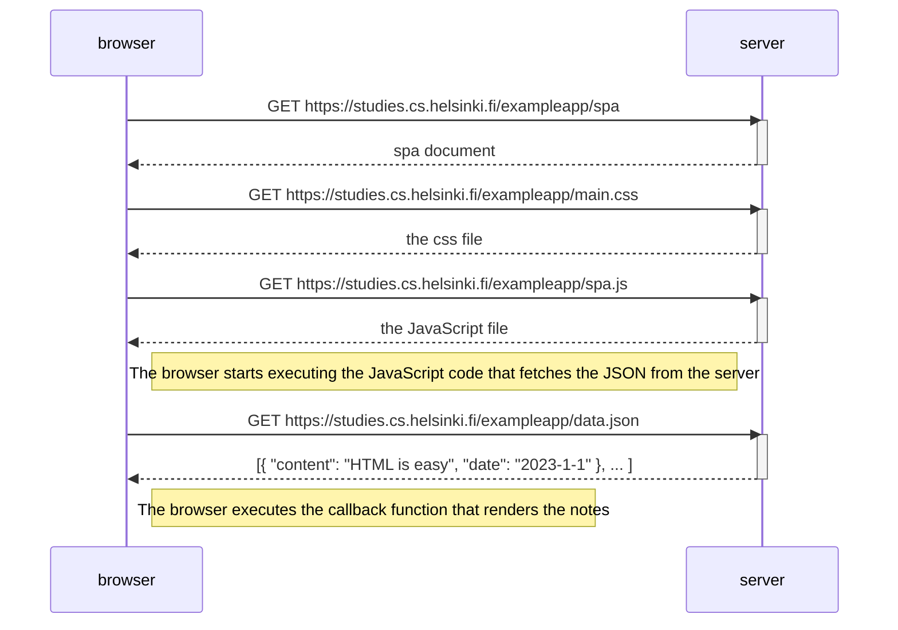

```mermaid
sequenceDiagram
    participant B as browser
    participant S as server

    B->>S: GET https://studies.cs.helsinki.fi/exampleapp/spa
    activate S
    S-->>B: spa document
    deactivate S

    B->>S: GET https://studies.cs.helsinki.fi/exampleapp/main.css
    activate S
    S-->>B: the css file
    deactivate S

    B->>S: GET https://studies.cs.helsinki.fi/exampleapp/spa.js
    activate S
    S-->>B: the JavaScript file
    deactivate S

    Note right of B: The browser starts executing the JavaScript code that fetches the JSON from the server

    B->>S: GET https://studies.cs.helsinki.fi/exampleapp/data.json
    activate S
    S-->>B: [{ "content": "HTML is easy", "date": "2023-1-1" }, ... ]
    deactivate S

    Note right of B: The browser executes the callback function that renders the notes
```
