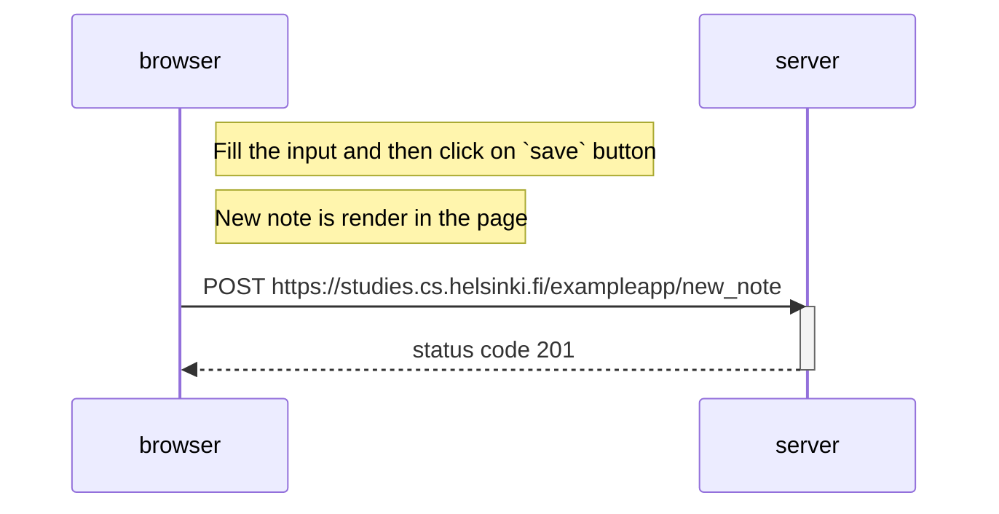

```mermaid
sequenceDiagram
    participant B as browser
    participant S as server

    Note right of B: Fill the input and then click on `save` button
    Note right of B: New note is render in the page
    B->>S: POST https://studies.cs.helsinki.fi/exampleapp/new_note
    activate S
    S-->>B: status code 201
    deactivate S
```
